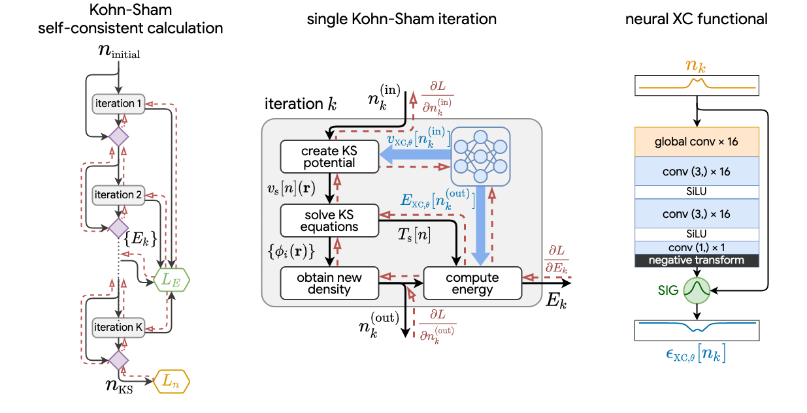

# KSR-DFT

## Overview

The Kohn-Sham regularizer (KSR) is a machine-learning technique to train neural network-based exchange-correlation (XC) models for density functional theory (DFT) calculations. KSR-DFT implements one-dimensional DFT using powerful [JAX](https://github.com/google/jax) primitives to enable JIT compilation, automatic differentiation, and high-performance computation on GPUs.

This library provides basic building blocks that can construct DFT calculations
as a differentiable program. The specific model architectures and training procedures used in the below papers are also implemented. Researchers in DFT and machine learning can use this library to build hybrid ML-DFT model for electronic structure research.

## Kohn-Sham equations as regularizer: building prior knowledge into machine-learned physics

Li Li, Stephan Hoyer, Ryan Pederson, Ruoxi Sun, Ekin D. Cubuk, Patrick Riley, Kieron Burke
https://arxiv.org/abs/2009.08551



Including prior knowledge is important for effective machine learning models in physics, and is usually achieved by explicitly adding loss terms or constraints on model architectures. Prior knowledge embedded in the physics computation itself rarely draws attention. We show that solving the Kohn-Sham equations when training neural networks for the exchange-correlation functional provides an implicit regularization that greatly improves generalization. Two separations suffice for learning the entire one-dimensional H_2 dissociation curve within chemical accuracy, including the strongly correlated region. Our models also generalize to unseen types of molecules and overcome self-interaction error.


## Installation

Clone this repository and install in-place:

```bash
git clone https://github.com/pedersor/ksr_dft.git
pip install -e ksr_dft
```

Please follow the installation for installation on GPU: https://github.com/google/jax#pip-installation

## Datasets

Reference data `ksr_dft/data/` is obtained from high-accuracy density matrix renormalization group (DMRG) calculations, unless otherwise indicated. The DMRG calculations are performed using [iTensor](https://github.com/ITensor/ITensor/tree/v2) and more info can be found in [this repo](https://github.com/pedersor/DFT_1d/tree/master/DMRG_1d).

## Citation

If you use the code in a publication, please cite the repo using the following:

```
@article{kalita2022well,
author = {Kalita, Bhupalee and Pederson, Ryan and Chen, Jielun and Li, Li and Burke, Kieron},
title = {How Well Does Kohn–Sham Regularizer Work for Weakly Correlated Systems?},
journal = {The Journal of Physical Chemistry Letters},
volume = {13},
number = {11},
pages = {2540-2547},
year = {2022},
doi = {10.1021/acs.jpclett.2c00371},
}
```


```
@article{li2020kohn,
  title = {Kohn-Sham Equations as Regularizer: Building Prior Knowledge into Machine-Learned Physics},
  author = {Li, Li and Hoyer, Stephan and Pederson, Ryan and Sun, Ruoxi and Cubuk, Ekin D and Riley, Patrick and Burke, Kieron},
  journal = {Phys. Rev. Lett.},
  volume = {126},
  issue = {3},
  pages = {036401},
  numpages = {7},
  year = {2021},
  month = {Jan},
  publisher = {American Physical Society},
  doi = {10.1103/PhysRevLett.126.036401},
  url = {https://link.aps.org/doi/10.1103/PhysRevLett.126.036401}
}
```


## Licenses
This code contains modified modules from [JAX-DFT](https://github.com/google-research/google-research/tree/master/jax_dft) and the headers of such files contain the appropriate copyright notices.

## Disclaimer

This is not an official Google product.